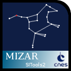

# MIZAR

## 1 - Description
MIZAR is a 3D application in a browser for discovering and visualizing geospatial data for sky and planets. It supports natively some protocols coming from OGC and IVOA :

| OGC           | IVOA          | Remarks about the support in MIZAR                          |
| ------------- |:-------------:| ----------------------------------------------------------- |
| WMS           | HIPS          | Do not read the WMS capabilities and the HIPS property file |
|               | MOC           | Supported                                                   |
| GeoJSON       | VOTable       | GeoJSON is only supported. A profile has been extended to define other keywords (see wiki). About VOTable, a service is needed to convert it in a GeoJSON format|
| WCS           |               | Elevation is supported                                      |
| OpenSearch    | SIAP / SSAP   | Need a service to convert the Healpix request and the response as GeoJSON |
|               | SAMP          | Supported but need a service to convert the VOTable to GeoJSON |
| WPS           | UWS           | WPS is not supported. UWS is partially supported and under some conditions |

Many name resolver / reverse name resolver can be plugged easily. In the current version, we have interface with the name resolver from CDS and this one from IMCCE by wrapping them into our API

In addition, MIZAR supports drag n drop of file : GeoJSON and FITS File (Read the first IMAGE extension ; can only represent the data when WCS keywords exist)

## 2 - Architecture

TODO

## 3 - Installation

It exists different ways to install MIZAR

### 3.1 - MIZAR

#### Getting the sources
	 `git clone https://github.com/SITools2/MIZAR.git mizar`
  
#### Getting the submodule [GlobWeb](https://github.com/TPZF/GlobWeb)
  * `cd mizar`
  * `git submodule init`
  * `git submodule update`
  
#### Copy the directory mizar in your web server
  `cp -R src/mizar <path to your web server>`

#### Run the application
  Go to http://..../mizar/index.html

In this mode, you will use a SITools2 server, installed somewhere,  that wraps the response coming from pre-defined sources (See wiki)

### 3.2 -MIZAR-lite
No installation, just import the javaScript (see Wiki) in your own web page

### 3.3 - MIZAR as SITools2V2 module
SITools2 is a data access layer server. It provides services and user interface to handle data published through SITools2. In this mode, MIZAR is added as an application in the SITools2 user interface. 

#### Install SITools2
 Download and install the packager https://github.com/SITools2/SITools2-core/releases/tag/v2.5
 
#### Install mizar 
  * `cd %SITOOLS%/workspace/client-user/js/modules`
  * `git clone https://github.com/SITools2/MIZAR.git mizarModule`
  * `cd mizarModule`
  * `git submodule init`
  * `git submodule update`
  
  TODO
  
  Run SiTools2 with the following command : `%SiTools2%/sitools.sh start` for Unix or `%SiTools2%/sitools.bat start` for Windows
  
  Configure the module
  
 * Initializer et mettre à jour le submodule [GlobWeb](https://github.com/TPZF/GlobWeb) qui assure le rendu:
  * `cd mizarModule`
  * `git submodule init`
  * `git submodule update`
 * Lancer SiTools2 avec la commande : `%SiTools2%/sitools.sh start` pour les OS de type Unix ou `%SiTools2%/sitools.bat start` pour Windows
 * Configurer le module :
  * Aller sur l'interface d'admin : http://localhost:8182/sitools/client-admin/* 
  * Loggez-vous avec `Login: admin`, `mot de passe: admin`
  * Cliquer sur Access Management/Projects/Project Modules
  * Créer le module avec les parametres dont vous souhaitez, sauf les suivants:
    * iconClass: mizar
    * Le xtype: sitools.component.mizarModule
    * Ajouter 2 dépendances: /sitools/client-user/js/modules/mizarModule/mizar.js et /sitools/common/res/css/mizar.css
  * Rendre visible le module sur le portail utilisateur
    * Cliquer sur Access Managements/Projects/Projects 
    * Désactiver le projet, éditer le et activer la visibilité pour le module Mizar
      * Dans le champ "Module parameters" mettre `undefined`

 * Ajouter un proxy pour l'affichage des données de base
   * Aller sur l'interface d'admin
   * Cliquer sur Access Management/Application plugins/Application plugins
   * Ajouter ProxyApp et configurer l'application comme ceci :
          * uri attachment :  /sitools/Alasky 
          * category : USER
          * useProxy : FALSE
          * url client : http://alasky.u-strasbg.fr{rr}     // oui, il faut bien ajouter {rr}
          * mode : 6
 * N'oubliez pas de l'activer

Ceci est une configuration minimaliste qui assure l'affichage des données visuelles.
Vous pouvez le visualizer en mettant : `http://localhost:8182/sitools/client-user/` dans votre navigateur.
Pour profiter de tous les avantages du module, il est nécessaire d'installer des services.

Installation des services:
---
Tout d'abord il faut ajouter l'extension astronomique qui contient les services disponibles
 * Télécharger fr.cnes.sitools.astronomy.jar [ici](http://sourceforge.net/projects/sitools2/files/Extensions/V2.0/)
 * Copier ce jar dans %SiTools2%\workspace\fr.cnes.sitools.core\ext
 * Relancer SiTools2 avec la commande `%SiTools2%/sitools.sh restart` pour les OS de type Unix ou `%SiTools2%/sitools.bat restart` pour Windows

Ajouter les services dans le projet
 * Aller sur l'interface d'admin
 * Cliquer sur Access Management/Projects/Project services
 * Ajouter les services suivants
   * Name Resolver Service, qui permet de trouver l'objet céleste à partir de son nom
   * Reverse Name Resolver Service, qui permet de trouver le nom d'objet à partir de sa position
   * Solar Objects Service, qui permet de trouver les objets célestes qui se trouvent dans le système solaire
   * GlobWeb Server, qui permet de configurer le module Mizar à partir de SiTools2
      * Mettre dans le champ 'conf' la valeur `mizarConf.ftl`
      * Créer un fichier 'mizarConf.ftl' dans `%SiTools%/data/freemarker/`, ce fichier peut être initialisé à partir du contenu du fichier `js/conf.json`
      * Cliquer sur Access Managements/Projects/Projects, choisir votre projet, mettre `/sitools/%uri de votre projet%/plugin/globWeb` dans le champ "Module Parameters" de Mizar
   * Couverage Service, qui permet de visualiser les données qui répresentent la couverture du ciel(fichiers MOC)
   * VOTable2GeoJson, qui permet d'afficher les VOTables reçu via protocole SAMP

Configuration par défaut
---
Le fichier de configuration se trouve ici : app/js/conf.json
Voir la doc sur [l'API JavaScript](https://github.com/SITools2/MIZAR/wiki/Client's-API) pour comprendre le fichier de configuration

Build
---
Pour générer une version minifiée, il est nécessaire d'avoir installé [NodeJS](http://nodejs.org/download/).

Une fois installé, lancez `app/build/build.bat` pour les utilisateurs de Windows ou `cd app/build` suivi de `node r.js -o buildMizar.js` pour les utilisateurs d'OS de type Unix.
Le script va générer un fichier minifié "MizarWidget.min.js" dans le répertoire parent.
Pour générer la feuille de style minifié utilisez la commande:
`node r.js -o cssIn=../css/style.css out=../css/style.min.css`

TODO: découpage en modules:
Pour générer tout, utilisez: `node r.js -o buildMizar.js`
Les fichiers intéressants à récupérer sont:
  * css
  * js
  * index.html

Il suffit donc de placer ces fichiers dans le repertoire de production `mizarModule/app/`

